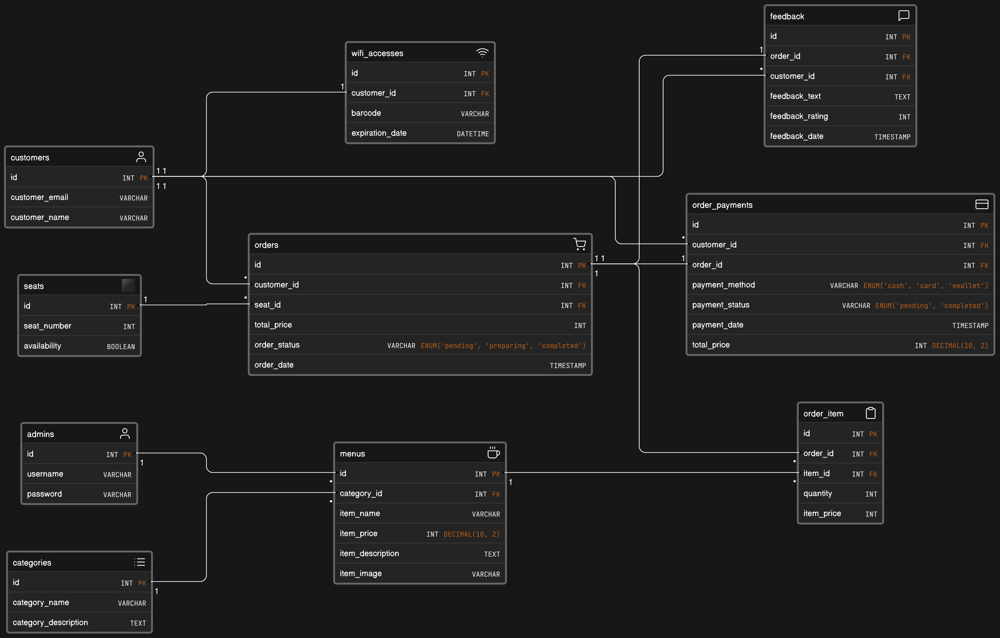

# SmartCafe API

SmartCafe is a mini project that revolutionizes cafe management by integrating technology to enhance customer experience, streamline operations, and provide intelligent insights for business growth. This project is built using Golang, a powerful and efficient programming language, and incorporates various features to make your cafe a smart and efficient place.

## Features

### 1. Customer Interaction

- Customers can view the cafe menu.
- Dynamic order recommendations when accessing the menu.
- Customers can place coffee orders as guests without the need to log in.

### 2. Order and Payment

- Generate a barcode for Wi-Fi access after placing an order.
- Digital payment options for a seamless customer experience.

### 3. Admin Management

- Admins can log in to access management features for menus.

## Tech Stack

- [Echo](https://echo.labstack.com/): Web Framework
- [Gorm](https://gorm.io/): Golang ORM
- [MySQL](https://www.mysql.com/): Relational Database
- [Docker](https://www.docker.com/): Containerization
- [AWS](https://aws.amazon.com/): Cloud Platform Deployment
- Clean Architecture: Code Structure
- [Barcode Generation Library](https://github.com/boombuler/barcode): Generate barcodes
- [Git](https://git-scm.com/): Version Control
- [Midtrans](https://www.midtrans.com/): Payment Gateway
- [JWT](https://jwt.io/): Authentication

## ERD

[View Full ERD](https://app.eraser.io/workspace/d0jHWzp9R6XxCPunrQoF?origin=share)

## API Documentation

Explore SmartCafe API using our [Postman Documentation](https://documenter.getpostman.com/view/23824709/2s9YRB2XBs).
